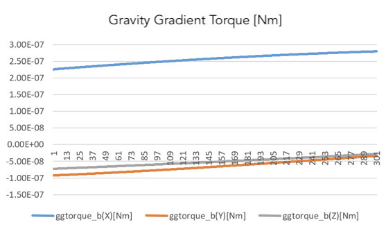

# Specification for Gravity Gradient Torque

## 1.  Overview

1. functions   
   - This class calculates the gravity gradient torque in the `Disturbances` class.

2. related files
   - GGDist.cpp, GGDist.h : Definitions and declarations of the class
   - Init_Disturbance.cpp : Interface functions for the initialization
   - Disturbance.ini : Initialization file

3. how to use
   - Set the parameters in `Disturbance.ini`
   - Create an instance by using the initialization function `InitGGdist`
   - Execute disturbance torque by `CalcTorque` function
   - Use `Get*` function to get attitude information
   
     
## 2. Explanation of Algorithm
1. `CalcTorque` function
   1. overview
      - This function performs disturbance calculation and torque output simultaneously. The GG torque is added to the disturbance torque when this function is called. This process is performed in each loop of the attitude calculation. The CalTorque function has two ways to specify the values used in the calculation. The function with two arguments takes the earth center direction vector and the inertia tensor of the satellite as arguments. The function with three arguments uses the unit vector and the distance of and the inertia tensor of the body as arguments.

   2. algorithm  
      Gravity gradient torque is calculated by the following equations (1) and (2). When two arguments are given, (1) is applied. When three arguments are given, (2) is used.
      ```math
         \boldsymbol{T}_{GG} = \cfrac{3 \mu}{R_0^5} \boldsymbol{R}_0 \times (\boldsymbol{I}\cdot \boldsymbol{R}_o)
         \tag{1}
      ```
      ```math
         \boldsymbol{T}_{GG} = \cfrac{3 \mu}{R_0^3} \boldsymbol{u} \times (\boldsymbol{I}\cdot \boldsymbol{u})
         \tag{2}
      ```
    
      where $\mu$ is the gravitational constant of the Earth, $R_0$ is the distance between the Earth center and the satellite, $\boldsymbol{R_0}$ is the vector from Earth center to the satellite, $\boldsymbol{I}$ is the inertia tensor of the satellite.

## 3. Results of verifications

1. verification of GG torque
   1. overview
      - Check that the GG torque equation is performed correctly

   2. conditions for the verification
      - PropStepSec: 0.001
      - StepTimeSec: 0.1
      - EndTimeSec: 300
      - Inertia tensor: diag [0.17, 0.1, 0.25]
      - Initial Quaternion_i2b: [0,0,0,1]
      - Initial torque: [0,0,0]
      - Initial angular velocity: [0,0,0]
      - Disturbance torque: All Disable except GGTorque

   3. results
      - The order of the gg torque is $10^7$, which seems a proper value.
      
         

## 4. References

1. 姿勢制御研究委員会, 人工衛星の力学と姿勢ハンドブック, 培風館, 2007. (written in Japanese)
