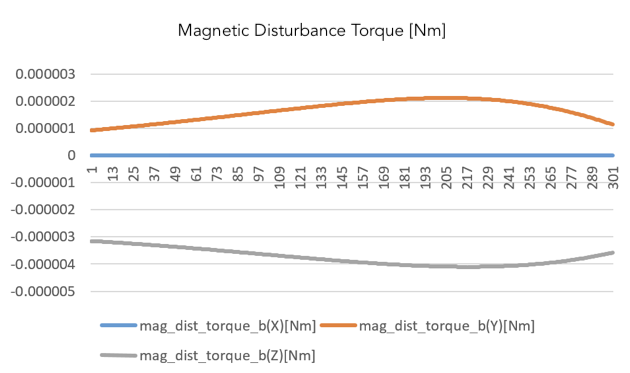
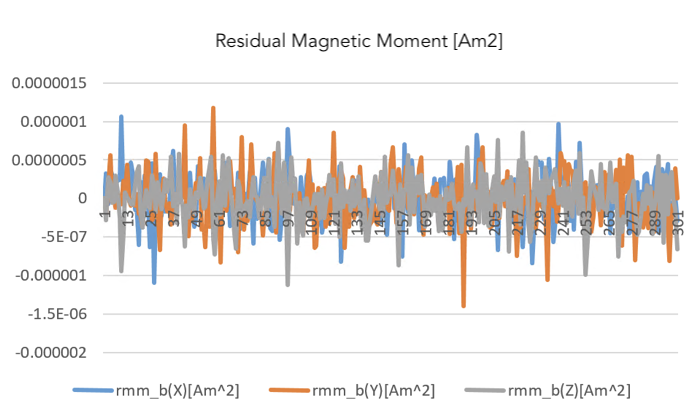
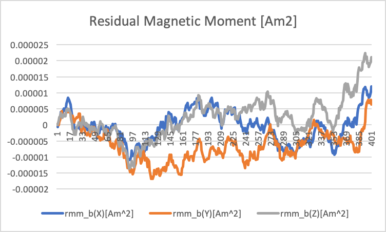
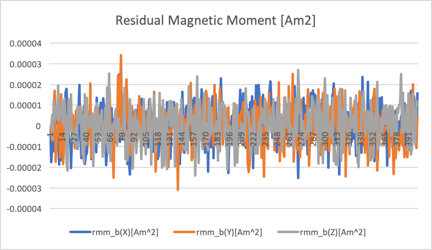

# Specification for Magnetic Disturbance Torque

## 1.  Overview

1. functions   
   - This class calculates the magnetic disturbance torque in the `Disturbances` class
   - This function receives the geomagnetic vector in the body-fixed coordinate system, calculates the cross product with the residual magnetic moment, and returns the residual magnetic torque in the body coordinate system.

2. related files
   - MagDisturbance.cpp, MagDisturbance.h : Definitions and declarations of the class
   - Init_Disturbance.cpp : Interface functions for the initialization
   - Disturbance.ini : Initialization file

3. how to use   
   - Set the parameters in `Disturbance.ini`
   - Create an instance by using the initialization function `InitMagDisturbance`
   - Execute disturbance torque by `CalcTorque` function
   - Use `Get*` function to get attitude information.
   
     

## 2. Explanation of Algorithm

1. `CalcTorque` function
   1. overview
      - This function performs disturbance calculation and torque output simultaneously. The magnetic disturbance torque is added to the disturbance torque when this function is called. This process is performed in each loop of the posture calculation.

   2. algorithm  
      Magnetic disturbance torque is calculated by the following equations (1). 
      ```math
         \boldsymbol{T}_{mag} = \boldsymbol{M} \times \boldsymbol{B}
         \tag{1}
      ```

      where $\boldsymbol{M}$ is the residual magnetic moment in the body-fixed frame, $\boldsymbol{B}$ is the magnetic field in the body-fixed frame.

2. `CalcRMM` function
   1. overview  
      This function calculates the residual magnetic moment(RMM) of the spacecraft. Usually, the RMM is varied by the power state of the components installed in the spacecraft, but this function emulates the variation of the RMM by a random walk process.

   2. inputs and outputs
      - inputs
         - (double) stddev_rw: standard deviation of the random walk 
         - (double) limit_rw: limit of the one-step of the random walk 
         - (double) stddev_wn: standard deviation of the white noise
      - outputs
         - (Vector<3>) RMM: the residual magnetic moment in the body-fixed frame

   3. algorithm  
      The residual magnetic moment is calculated by the following equations (2). 
       ```math
         \boldsymbol{M}(t_{k+1}) = \boldsymbol{M}_0 + \boldsymbol{r}(t_{k+1}) + \boldsymbol{w}_1(t_{k+1}) \\
         \boldsymbol{r}(t_{k+1}) = \boldsymbol{r}(t_{k}) +\boldsymbol{w_2}(t_{k+1})
         \tag{2}
      ```
      where $\boldsymbol{M}_0$ is the average residual magnetic moment in the body-fixed frame, $\boldsymbol{r}$ is the random walk of RMM, and $\boldsymbol{w}_i \sim N([0,0,0],\Sigma_i)$ is the white noise.

## 3. Results of verifications

1. verification of magnetic disturbance torque
   1. overview
      - Check that the magnetic disturbance torque equation is performed correctly.

   2. conditions for the verification
      - PropStepSec: 0.001
      - StepTimeSec: 0.1
      - EndTimeSec: 300
      - Inertia tensor: diag [0.17, 0.1, 0.25]
      - Initial Quaternion_i2b: [0,0,0,1]
      - Initial torque: [0,0,0]
      - Initial angular velocity: [0,0,0]
      - Disturbance torque: All Disable except magnetic disturbance torque.

   3. results
      - RMM = [0.1,0,0]Am2
        - T = residual magnetic moment × magnetic field
        - The Y component of the earth's magnetic field corresponds to the Z component of the disturbance torque, and the Z component of the earth's magnetic field corresponds to the -Y component of the disturbance torque
         
         

      - RMM = [0.05,0.05,0.05]Am2
         The order becomes $10^6$, which is a proper value.
         

2. verification of RMM
   1. overview
      - Check that the RMM equation is performed correctly.

   2. conditions for the verification
      - PropStepSec: 0.001
      - StepTimeSec: 0.1
      - EndTimeSec: 300
      - Inertia tensor: diag [0.17, 0.1, 0.25]
      - Initial Quaternion_i2b: [0,0,0,1]
      - Initial torque: [0,0,0]
      - Initial angular velocity: [0,0,0]
      - Disturbance torque: All Disable

   3. results
      - [stddev_rw, limit_rw, stddev_wn] =  [1E-5,0,0]
      - RMM random walk value is much smaller than 1E-5, because random walk limit is 0. 

      
      
      - [stddev_rw, limit_rw, stddev_wn] =  [1E-5,1E-4,0]
   
      
      
      - [stddev_rw, limit_rw, stddev_wn] =  [0,0,1E-5]
   
      

## 4. References
1. 姿勢制御研究委員会, 人工衛星の力学と姿勢ハンドブック, 培風館, 2007. (written in Japanese)
