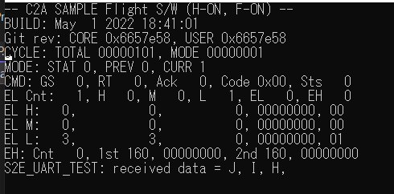

# How to integrate C2A

## 1.  Overview
- [C2A](https://github.com/ut-issl/c2a-core) (Command Centric Architecture) is an architecture for spacecraft flight software developed by [ISSL](https://www.space.t.u-tokyo.ac.jp/nlab/index.html).
- S2E can execute [C2A](https://github.com/ut-issl/c2a-core) as a flight software for onboard algorithm development and debugging.
- This document describes how to integrate the C2A.
- Notes
  - C2A is written in C language, but S2E builds C2A as C++.
- The supported version of this document
  - Please confirm that the version of the documents and s2e-core is compatible.

## 2. Overview of C2A execution in S2E
- Directory construction
  - Make `FlightSW` directory at same directory with `s2e-core` and `s2e-user`.
  - Make a `c2a-user` directory in `FlightSW` and set the C2A source code you want to use.
    ```
    ├─ExtLibraries
    ├─FlightSW
    │  └─c2a-user
    │    └─src_user
    │    └─src_core
    ├─s2e-core
    └─s2e-user
    ```
  - Edit `s2e-user/CMakeLists.txt`
    - `set(C2A_NAME "c2a_sample")`
      - Edit the directory name according to your situation
    - `option(USE_C2A "Use C2A" OFF)`
      - Turn on the USE_C2A flag as `option(USE_C2A "Use C2A" ON)`
- NOTE
  - In the default setting of S2E, C2A is built but isn't executed. To execute the C2A, users need to add the `OBC`, which can execute the C2A.
  - The `s2e-core` has the [OBC_C2A](https://github.com/ut-issl/s2e-core/blob/develop/src/Component/CDH/OBC_C2A.cpp) as a component, and users can use it to execute the C2A.
  - Users can use the `OBC_C2A` class in the `User_components` class, the same as other components.
- Build the `s2e_user`
  - **Note:** When you add new source files in the C2A, you need to modify the `c2a-user/CMakeLists.txt` directory to compile them in the S2E.
  - Users can choose the construction of CMake as users need.
  - For example, the sample codes have several `CMakeLists.txt` files in each directory to set the compile targets, so users need to modify them to add the target source codes.

## 3. How to build C2A in S2E with the sample codes
- Sample codes
  - A sample of s2e-user: [s2e-user-for-c2a-core](https://github.com/ut-issl/s2e-user-for-c2a-core)
  - A sample of c2a-user: [C2A minimum user](https://github.com/ut-issl/c2a-core/tree/develop/Examples/minimum_user) in `c2a-core`.
- Preparing development environment
  - Clone the `s2e-core` v5.1.0.
    - Please set the environment for that the s2e-core can work without C2A.
  - Clone `s2e-user-for-c2a-core` at same directory with `s2e-core`. 
  - Make `FlightSW` directory at same directory with `s2e-core`.
  - Clone `c2a-core` in the `FlightSW` directory.
    - Switch to tag `v3.7.0`
  - Execute `c2a-core/setup.sh` or `c2a-core/setup.bat`.
  - Open `s2e-user/CMakeLists.txt` and edit `set(C2A_NAME "c2a_sample")` to `set(C2A_NAME "c2a-core/Examples/minimum_user")`
  - **For users who don't use Windows**, open `c2a-core/Examples/minimum_user/CMakeLists.txt` and edit `option(USE_SCI_COM_WINGS "Use SCI_COM_WINGS" ON)` to `option(USE_SCI_COM_WINGS "Use SCI_COM_WINGS" OFF)`
    - This setting turns off the feature to communicate with [WINGS](https://github.com/ut-issl/wings) ground station. Currently, this feature is available only for Windows users.
  - Build and execute the `s2e-user-for-c2a-core`.

## 4. Communication between C2A and S2E for SILS test
- Generally, communication between flight software and S2E is executed via `OBC` class.
- The `OBC` base class has communication ports and communication functions. Other components and flight software can use the communication functions to communicate.
- For C2A, the `OBC_C2A` has the following functions for C2A flight software. The driver functions in the flight software can use these functions. It is essential to use the same `port_id` with the component setting in S2E. The details are described in specification documents for each feature. 
  - Serial communication functions
    ```cpp
    int OBC_C2A_SendFromObc(int port_id, unsigned char* buffer, int offset, int count);
    int OBC_C2A_ReceivedByObc(int port_id, unsigned char* buffer, int offset, int count);
    ```
  - I2C communication functions
    ```cpp
    int OBC_C2A_I2cWriteCommand(int port_id, const unsigned char i2c_addr, const unsigned char* data, const unsigned char len);
    int OBC_C2A_I2cWriteRegister(int port_id, const unsigned char i2c_addr, const unsigned char* data, const unsigned char len);
    int OBC_C2A_I2cReadRegister(int port_id, const unsigned char i2c_addr, unsigned char* data, const unsigned char len);
    ```
  - GPIO
    ```cpp
    int OBC_C2A_GpioWrite(int port_id, const bool is_high);
    bool OBC_C2A_GpioRead(int port_id);
    ```
- Currently, the C2A uses the wrapper functions in [IfWrapper/Sils](https://github.com/ut-issl/c2a-core/tree/develop/Examples/minimum_user/src/src_user/IfWrapper/Sils). The functions automatically overload the normal IfWrapper functions when C2A is executed on the S2E.
- Other interfaces like SPI, etc., will be implemented.


# 5. Example of S2E-C2A communication
- This section shows an example of communication between a component in S2E and an application in C2A. The sample codes are in `Tutorials/SampleCodes/C2A_Integration`.
- Preparation
  - See `Ch. 3 How to build C2A in S2E with the sample codes`.
- Modification of the S2E side
  - Users can use the [EXP](https://github.com/ut-issl/s2e-core/blob/develop/src/Component/Abstract/EXP.h) class in `s2e-core` as a test component to communicate with C2A.
  - Please refer the sample codes in `Tutorials/SampleCodes/C2A_Integration/S2E_src`.
    - The directory structure of `S2E_src` is same with that of `s2e-user-for-c2a-core`. 
  - Add `EXP` as a component in `c2a_core_sample_components.cpp and .h`.
    - Or simply just copy the source codes in `C2A_Integration/S2E_src` to `s2e-user-for-c2a-core`.
    - In this example, the `OBC_C2A` is executed as 1kHz, and the `EXP` is executed as 1Hz.
 - Modification of the C2A side
   - Please refer the sample codes in `Tutorials/SampleCodes/C2A_Integration/C2A_src_user`. 
     - The directory structure of `C2A_src_user` is same with that of `c2a-core/Examples/minimum_user/src/src_user`.
   - We need to add a new driver instance application to communicate with the `EXP` component.
     - Copy `Application/DriverInstances/di_s2e_uart_test.c and .h`
     - Edit `CMakeLists.txt` in the Application directory to add `di_s2e_uart_test.c` as a compile target.
   - Edit `app_registry.c, h` and `app_headers.h` in the `Application` directory to register the applications of `di_s2e_uart_test`.
     - We have two applications `AR_DI_S2E_UART_TEST` and `AR_DI_DBG_S2E_UART_TEST`.
   - Edit `Setting/Modes/TaskLists/Elements/tl_elem_drivers_update.c` to add the `AR_DI_S2E_UART_TEST` to execute the application in the tasklist.
   - Edit `Setting/Modes/TaskLists/Elements/tl_elem_debug_display.c` to add the `AR_DI_DBG_S2E_UART_TEST` to execute the application in the tasklist.
   
- Execution and Result
  - The `AR_DI_S2E_UART_TEST` application sends characters to the `EXP` component like `SETA, SETB, SETC, ..., SETZ, SETA`
  - The `EXP` component receives the characters and stores the set characters like `A, B, C, ..., Z, A`
  - The `EXP` component sends the stored characters as telemetry like `A, BA, CBA, ..., ZYX`
  - The `AR_DI_S2E_UART_TEST` application receives the telemetry, and the `AR_DI_DBG_S2E_UART_TEST` application prints the first three characters in the debug output console like the following figure.
    

